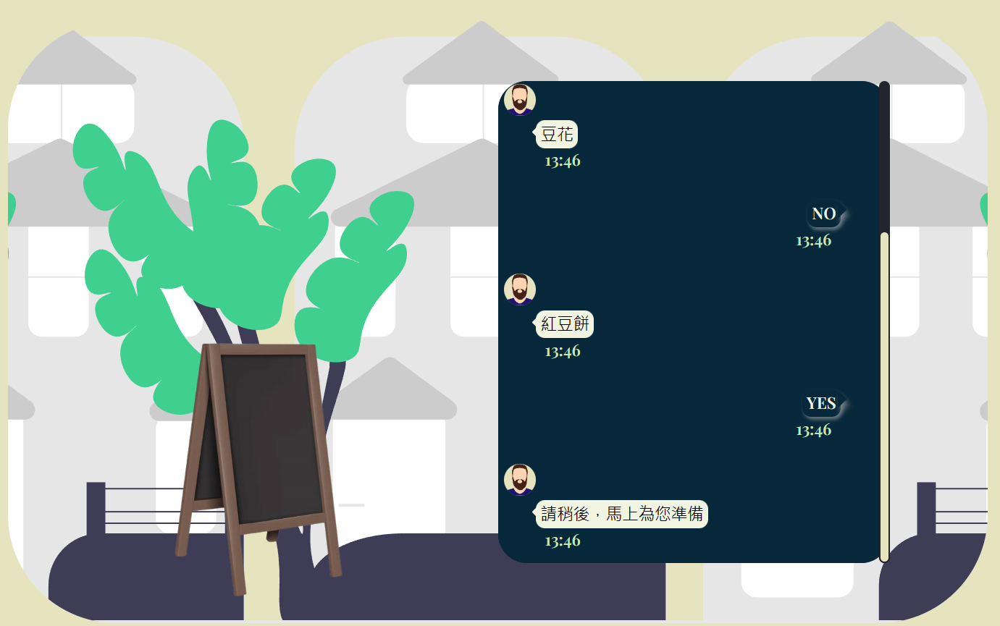

<a id="readme-topside"></a>

<h2 align="center">Decide What to Eat(決定吃什麼)</h2>

<details>
  <summary>Description List</summary>
  <ol> 
    <li><a href="#demo">Demo</a></li>
    <li><a href="#about-the-project">About The Project</a>
      <ul><li><a href="#built-with">Built With</a></li></ul>
    </li>
    <li>
      <a href="#getting-started">Getting Started</a>
      <ul>
        <li><a href="#prerequisites">Prerequisites</a></li>
        <li><a href="#installation">Installation</a></li>
        <li><a href="#how-to-use?">How to Use?</a></li>
      </ul>
    </li>
    <li><a href="#thanks">Thanks</a></li>
  </ol>
</details>

## Demo




## About The Project

### Built With

Angular 12
SCSS

## Getting Started

### Prerequisites

- Node.js version
  ^12.14.1 || ^14.15.0

- TypeScript version
  ~4.2.4

- Angular Cli version
  ~12.0.5

### Installation

1. Clone the repo

```sh
git clone https://github.com/Cazanna-Tolean/eat-what.git
```

2. Install NPM dependency

```sh
npm install
```

### How to Use?

1. Revise the Mock data

file path

```
src\app\data\mockData.ts
```

2. run the project

```sh
ng serve
```

## Thanks

1. Thanks to my parents and friends for supporting the work I gonna do.
2. Also thank [Sara Vieira](https://twitter.com/NikkitaFTW) that her projects gave me such awesome ideas.

<p align="right">(<a href="#readme-topside">back to top</a>)</p>
